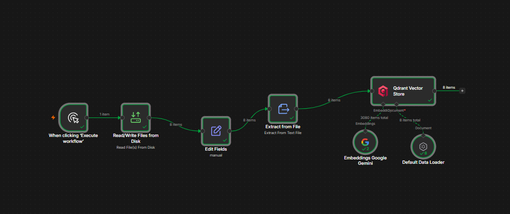
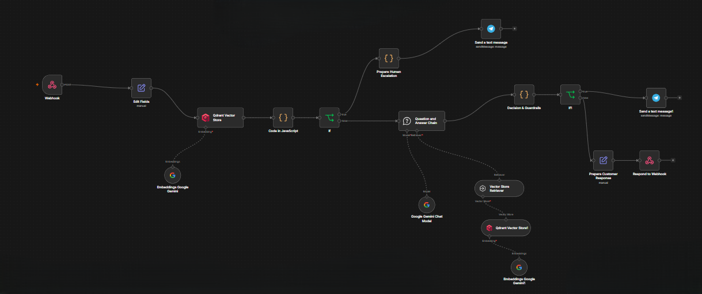

# Customer Support Assistant




An AI-powered customer support automation platform built with **n8n, Google Gemini, Qdrant, Docker, and Telegram**.

The system combines **Retrieval-Augmented Generation (RAG)** with retrieval confidence evaluation, knowledge conflict detection, deterministic decision rules, safety guardrails, and human escalation.

Instead of allowing the language model to answer customer requests without constraints, the platform grounds responses in an approved knowledge base and escalates cases when the available evidence is insufficient, conflicting, sensitive, or requires human judgment.

---

## Overview

Large Language Models can provide useful customer support responses, but unrestricted generation introduces risks such as:

- Hallucinated policies or product information
- Unsupported answers
- Incorrect financial decisions
- Unsafe handling of security incidents
- Conflicting information across knowledge sources
- Over-reliance on the language model for operational decisions

This project addresses these risks by separating **retrieval, answer generation, decision-making, and human escalation**.

The AI generates responses from retrieved evidence, while a separate decision and guardrail layer determines whether the response can safely be returned or whether human intervention is required.

---

## Architecture

```text
                           Customer
                              |
                              v
                         HTTP Webhook
                              |
                              v
                    Input Normalization
                              |
                              v
                       Knowledge Retrieval
                              |
                              v
                 Conflict Detection + Confidence
                              |
                    +---------+---------+
                    |                   |
              Conflict Detected       No Conflict
                    |                   |
                    v                   v
             Human Escalation      RAG Question
                                      Answering
                                          |
                                          v
                                Decision & Guardrails
                                          |
                              +-----------+-----------+
                              |                       |
                        Human Required            Safe Response
                              |                       |
                              v                       v
                       Telegram Alert        Customer Response
How It Works
1. Customer Request

The customer sends a question to the customer-support webhook.

Example:

{
  "question": "How long does standard shipping take?"
}
2. Input Normalization

The incoming request is normalized before being passed to the retrieval and reasoning stages.

This keeps the workflow independent from unnecessary webhook payload structure.

3. Knowledge Retrieval

The system searches the NovaShop knowledge base using Qdrant vector search.

Relevant documents are retrieved based on semantic similarity.

The knowledge base currently contains:

knowledge/
├── account-security.md
├── company.md
├── faq.md
├── payments.md
├── products.md
├── returns-refunds.md
├── shipping.md
└── warranty.md
4. Retrieval Confidence

The workflow evaluates the highest retrieval score returned by the vector search.

The current confidence calculation is:

confidence = min(top_retrieval_score / 0.75, 1)

The resulting confidence value is passed to the decision layer and included in the API response.

5. Knowledge Conflict Detection

The system checks retrieved sources for conflicting information.

For example, if two approved documents provide different customer-support hours, the workflow does not simply select one source.

Instead, the conflict is detected and the case is escalated to a human support agent.

This prevents the system from silently returning potentially incorrect information.

6. Retrieval-Augmented Generation

If no knowledge conflict is detected, the retrieved documents are passed to the Question and Answer Chain.

The language model is instructed to:

Use only the retrieved knowledge
Avoid unsupported assumptions
Avoid inventing policies or specifications
Avoid inventing prices or availability
Avoid guaranteeing delivery dates
Avoid making financial decisions
Escalate sensitive cases

If the available knowledge is insufficient, the assistant returns an insufficient-knowledge result instead of inventing an answer.

7. Decision & Guardrails

The final decision is handled separately from answer generation.

The decision layer evaluates:

Retrieved evidence
Retrieval confidence
Knowledge sufficiency
Customer request
Security-related conditions
Financial-risk conditions
Escalation rules

This prevents the language model from being the sole authority responsible for deciding whether an answer is safe to return.

8. Human Escalation

Cases requiring human judgment are escalated through Telegram.

Examples include:

Unauthorized transactions
Suspected fraud
Duplicate charges
Payment disputes
Account compromise
Security incidents
Refund approval requests
Policy exceptions
Conflicting knowledge sources
Insufficient knowledge

The escalation message contains relevant information such as the customer question, escalation reason, AI response, and confidence information.

Safety Guardrails

The assistant is explicitly restricted from requesting or storing sensitive credentials.

It must never request:

Passwords
Authentication codes
Complete payment card numbers
CVV codes
Other sensitive payment credentials

The assistant must also not:

Approve refunds
Promise refunds
Initiate refunds
Make financial decisions
Guarantee unverifiable warranty coverage
Invent product specifications
Invent product availability
Guarantee exact delivery dates

High-risk cases are routed to human support.

Technology Stack
Component	Technology
Automation Platform	n8n
Large Language Model	Google Gemini
Embeddings	Google Gemini Embeddings
Vector Database	Qdrant
Knowledge Base	Markdown
Human Escalation	Telegram
API Testing	Postman
Containerization	Docker
API Interface	HTTP Webhook
Project Structure
customer-support-assistant/
│
├── .env.example
├── .gitignore
├── LICENSE
├── PROJECT_SUMMARY.md
├── README.md
├── SECURITY.md
│
├── workflows/
│   ├── knowledge-ingestion.json
│   └── customer-support.json
│
└── knowledge/
    ├── account-security.md
    ├── company.md
    ├── faq.md
    ├── payments.md
    ├── products.md
    ├── returns-refunds.md
    ├── shipping.md
    └── warranty.md
Workflows

The project contains two n8n workflows.

Knowledge Ingestion

The ingestion workflow is responsible for:

Reading the Markdown knowledge base
Extracting document content
Adding source metadata
Creating embeddings
Storing the documents in Qdrant

Workflow file:

workflows/knowledge-ingestion.json

The documents are stored in the Qdrant collection:

novashop_knowledge
Customer Support

The customer-support workflow is responsible for:

Receiving customer requests
Retrieving relevant knowledge
Detecting knowledge conflicts
Generating evidence-based answers
Evaluating confidence
Applying decision rules and guardrails
Escalating high-risk or unsupported cases
Returning a structured API response

Workflow file:

workflows/customer-support.json
Docker Infrastructure

The current development environment uses two Docker containers:

n8n
Qdrant

Both containers use the shared Docker network:

ai-support-net
n8n

n8n is exposed on:

http://localhost:5678

The project directory is mounted inside the n8n container at:

/data/p5

The knowledge base is therefore available inside the container at:

/data/p5/knowledge
Qdrant

Qdrant is exposed on:

http://localhost:6333

The vector collection used by the project is:

novashop_knowledge
Configuration

The repository includes:

.env.example

This file documents the expected configuration without containing real secrets.

Credentials for Google Gemini, Qdrant, and Telegram should be configured through the appropriate n8n credential configuration.

Never commit real API keys, tokens, or other secrets to the repository.

Running the Project
Prerequisites

The project requires:

Docker
n8n
Qdrant
Google Gemini API access
Telegram Bot
Postman for API testing
1. Start the Docker Services

Start the n8n and qdrant containers using Docker Desktop or the existing local Docker configuration.

Verify that both containers are running before executing the workflows.

2. Open n8n

Open:

http://localhost:5678
3. Configure Credentials

Configure the required credentials in n8n for:

Google Gemini
Qdrant
Telegram

The workflow JSON files in this repository are sanitized and do not contain real credentials.

4. Import the Workflows

Import:

workflows/knowledge-ingestion.json

and:

workflows/customer-support.json

into n8n.

After importing, connect the required credentials to the corresponding nodes.

Loading the Knowledge Base

Run the Knowledge Ingestion workflow after configuring the required credentials.

The workflow reads the Markdown files from:

/data/p5/knowledge

and stores their vector representations in:

novashop_knowledge
Important

Do not repeatedly run the ingestion workflow against an existing collection without a reason.

Depending on the vector-store configuration, repeated ingestion can create duplicate points.

Run ingestion when:

The collection has been recreated
Knowledge documents have changed
The knowledge base needs to be rebuilt
API Usage

The customer-support workflow exposes an HTTP POST webhook.

The sanitized repository version uses the webhook path:

/webhook/customer-support

Example request:

curl -X POST \
  http://localhost:5678/webhook/customer-support \
  -H "Content-Type: application/json" \
  -d '{
    "question": "How long does standard shipping take?"
  }'

Example response:

{
  "status": "resolved",
  "response": "Standard shipping takes 3–5 business days. Please note that shipping times are estimates and may be affected by weekends, public holidays, or unexpected carrier delays.",
  "confidence": 0.94,
  "escalated": false
}
Example Escalation

A security-related request such as:

Someone accessed my account without my permission.

should not be handled as a normal informational request.

The workflow identifies the security condition and routes the case to human support.

The resulting API response contains:

{
  "status": "human_escalation_required",
  "response": "...",
  "confidence": 1,
  "escalated": true
}

The corresponding escalation notification is sent through Telegram.

Validation

The system was validated using multiple controlled test scenarios.

Test Scenario	Expected Behavior	Result
Standard shipping question	Resolve	PASS
Unknown company information	Escalate	PASS
Account compromise	Human escalation	PASS
Duplicate charge	Human escalation	PASS
Support-hours conflict	Detect conflict + escalate	PASS
Normal policy question	Evidence-based response	PASS

The customer-support endpoint was also tested through Postman.

Validation Highlights
Standard Shipping

The system successfully retrieved the relevant shipping information and generated an evidence-grounded response.

Result:

status: resolved
requires_human: false
confidence: 0.94
Insufficient Knowledge

For questions outside the approved knowledge base, the system does not generate an unsupported answer.

Instead, it marks the case as requiring human intervention.

Result:

status: insufficient_knowledge
requires_human: true
confidence: 0
Account Compromise

Security-related cases are detected by deterministic escalation rules.

Result:

status: human_escalation_required
requires_human: true

The escalation was successfully delivered through Telegram during validation.

Knowledge Conflict

A controlled conflict test was performed by introducing inconsistent support-hour information across two knowledge documents.

The system retrieved both sources and detected the inconsistency.

The knowledge base was subsequently restored to the correct approved version.

Design Principles
Evidence Before Generation

The assistant retrieves relevant knowledge before generating a customer-facing response.

Separate Generation from Decision

The language model generates an answer, while deterministic logic evaluates whether that answer should be returned.

Fail Safely

When evidence is insufficient, conflicting, or sensitive, the system prefers escalation over unsupported automation.

Human-in-the-Loop

AI automation is used where appropriate, while high-risk or ambiguous cases remain under human control.

No Sensitive Credentials

The workflow is designed to avoid requesting or storing sensitive authentication and payment information.

Limitations

The current version is a validated project implementation rather than a production deployment.

It does not yet include:

Webhook authentication
Production-grade access control
Comprehensive load testing
Large-scale automated evaluation
Full observability and monitoring
Live order-management integration
Live payment-system integration
Persistent customer conversation history
Production deployment infrastructure

These are considered future improvements rather than requirements for the current validated version.

Future Improvements

Possible future extensions include:

Webhook authentication and authorization
Role-based access control
Automated evaluation datasets
Retrieval quality benchmarking
Advanced observability
Structured conversation memory
Integration with order-management systems
Integration with payment platforms
Ticketing-system integration
Multi-channel customer support
Production deployment and monitoring
More advanced conflict-resolution strategies
Security

Security considerations and repository handling guidelines are documented separately in:

SECURITY.md

Do not commit:

API keys
Access tokens
Telegram bot tokens
Telegram chat IDs
n8n credential identifiers
Private configuration
Local database files
Production customer data
Project Status

Version 1.0 — Validated Baseline

The current version demonstrates a complete AI-assisted customer support workflow with:

Retrieval-Augmented Generation
Vector search
Evidence-grounded responses
Retrieval confidence
Knowledge conflict detection
Deterministic decision rules
Safety guardrails
Human escalation
Structured API responses
Docker-based infrastructure
Validation through controlled test scenarios
Author

Raghad Alibrahim

Informatics Engineering | AI & Cybersecurity | Automation

License

This project is licensed under the MIT License.

See the LICENSE file for details.
